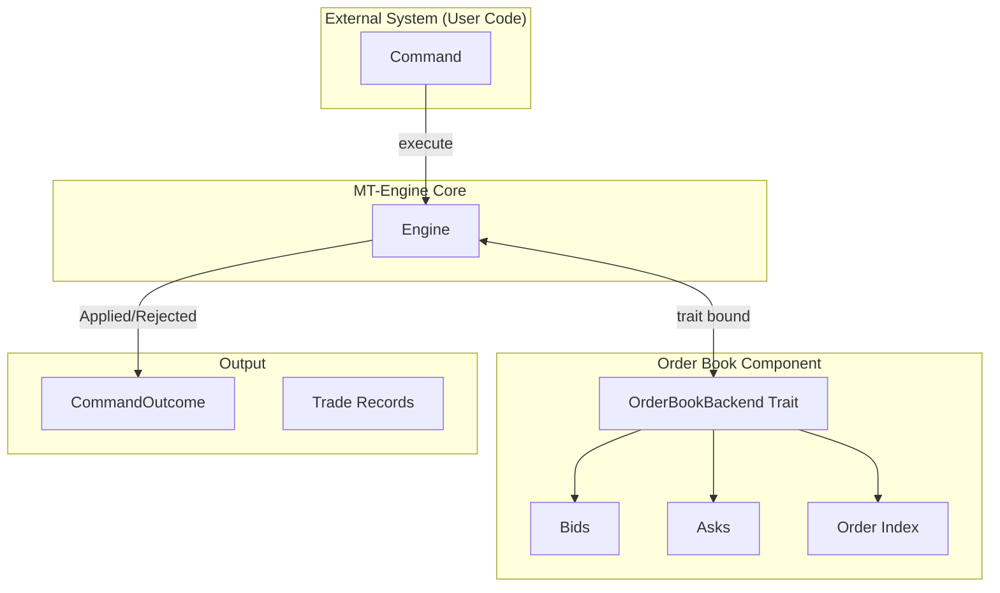

# MT-Engine Architecture Design Document

[English](ARCHITECTURE.md) | [中文](ARCHITECTURE_ZH.md)

## 1. Overview

### 1.1 Background & Goals

MT-Engine is a high-performance, deterministic order matching engine library implemented in Rust. Designed specifically for trading systems, it follows the core principles of the LMAX architecture, implementing the matching engine as a single-threaded, deterministic, in-memory state machine.

**Core Design Goals:**

- **Deterministic Execution**: The same inputs must produce the same outputs, supporting backtesting, replay, and auditing.
- **Single-Threaded Design**: Avoid lock contention and synchronization overhead to achieve predictable low latency.
- **In-Memory State**: All states are stored in memory; persistence and network communication are handled externally.
- **Command-Result Model**: Clear input/output contracts for easy integration and testing.

### 1.2 Core Terminology

| Term | Definition |
|------|------|
| **Order Book** | Data structure recording all unexecuted resting orders. |
| **Matching** | The process of pairing buy and sell orders based on Price-Time priority. |
| **Taker** | The aggressive party initiating the trade, consuming market liquidity. |
| **Maker** | The passive party waiting for execution, providing market liquidity. |
| **Price Level** | A group of all orders at the same price. |
| **Time Priority** | Within the same price level, orders submitted earlier execute first. |
| **SBE (Simple Binary Encoding)** | High-performance binary encoding standard used for message serialization. |
| **Deterministic** | Given the same initial state and sequence of commands, the same result is guaranteed. |

### 1.3 Project Phases

| Phase | Status | Description |
|------|------|------|
| **Phase 1: SBE Protocol Layer** | ✅ Done | Binary message encoding/decoding supporting OrderSubmit/Cancel/Amend/Trade. |
| **Phase 2: Core Matching Engine** | ✅ Done | Implemented LTP-triggered stop-loss/take-profit, iceberg requeuing, and E2E strategies. |
| **Phase 3: Optimization (Sparse)** | ✅ Done | Full-path zero-allocation, SBE unwrap_unchecked, hardware prefetching, cache-line ABI alignment. |
| **Phase 4: Dense Engine & Scalability** | ✅ Done | Bitset-based tree-less backend, O(1) matching for dense assets. |

### 1.4 Design Principles

1. **Immutability over Mutability**: Prefer immutable data structures to reduce side effects.
2. **Explicit over Implicit**: API design emphasizes clarity over brevity.
3. **Composition over Inheritance**: Use composition to build complex types.
4. **Errors as Values**: Use `Result` types for error handling instead of exceptions.
5. **Zero-Cost Abstractions**: Abstractions should not introduce runtime overhead.
6. **SBE Compatibility**: Exposed structs are designed with fixed sizes to facilitate SBE parser processing.

---

## 2. Project Structure

### 2.1 Code Organization

```
mt-engine/
├── Cargo.toml              # Workspace Config
├── mt-engine-core/         # Core Engine
│   └── Cargo.toml
├── mt-engine-sbe/          # SBE Encoding/Decoding Layer
│   ├── src/
│   │   ├── lib.rs                          # Library entry, exports all codecs
│   │   ├── message_header_codec.rs         # Message header codec
│   │   ├── order_submit_codec.rs           # Order submission (64 bytes)
│   │   ├── order_cancel_codec.rs           # Order cancellation (24 bytes)
│   │   ├── order_amend_codec.rs            # Order amendment (40 bytes)
│   │   ├── order_submit_gtd_codec.rs       # GTD Order submission (72 bytes)
│   │   ├── trade_codec.rs                  # Trade execution (64 bytes)
│   │   ├── side.rs                         # Side enum
│   │   ├── order_type.rs                   # Order type enum
│   │   ├── time_in_force.rs                # Time In Force enum
│   │   └── order_flags.rs                  # Order flags bitset
│   └── Cargo.toml
├── schemas/                 # SBE XML Schema Definitions
│   └── mt-engine/
│       └── templates_FixBinary.xml
└── docs/                    # Documentation
    ├── ARCHITECTURE.md
    ├── SBE_INTEGRATION_GUIDE.md
    └── TRANSACTION_TYPES.md
```

---

## 3. Core Engine Architecture

### 3.1 Overall Architecture



### 3.2 Dual Engine Backend Abstraction

To cater to different asset liquidity characteristics, MT-Engine implements a dual-backend strategy:

| Feature | `DenseBackend` (HFT) 🚀 | `SparseBackend` (General) 🧩 |
|------|---------------|-----------------|
| **Price Lookup** | L3 Bitset | BTreeMap |
| **Order Mapping** | Array + Free List | Slab + HashMap |
| **Queue Structure**| Intrusive Doubly Linked List | VecDeque / Intrusive Triggers |
| **Memory Alloc** | Pre-allocated | Dynamic (Slab Pool) |
| **Latency Expectation** | < 30ns | < 100ns (Optimized) |
| **Best For** | Mainstream assets (BTC/ETH) | Altcoins/NFTs/Long-tail |

### 3.3 SoA vs AoS Optimization

```
AoS Mode (Traditional):
┌─────────────────────────────────┐
│ Order[0]: { qty, side, ts, uid }│  ← Accessing qty also loads ts/uid into cache
│ Order[1]: { qty, side, ts, uid }│
│ Order[2]: { qty, side, ts, uid }│
└─────────────────────────────────┘

SoA Mode (Optimized):
┌─────────────────────────────────┐
│ qty_array:  [10, 20, 30, ...]   │  ← Only needed fields are loaded
│ side_array: [0,  1,  0,  ...]   │  ← Cache line only contains hot data
├─────────────────────────────────┤
│ ts_array:   [ts1, ts2, ts3,...] │  ← Cold data loaded on demand
│ uid_array:  [u1,  u2,  u3,...]  │
└─────────────────────────────────┘

Cache hit rate comparison (Matching scenarios):
- AoS: ~60% (loaded unneeded fields)
- SoA: ~95% (only loaded hot data)
```

---

## 4. Hardware Prefetching & Cache Line Alignment

### 4.1 OrderData Cache Alignment

```rust
/// Order Data (Extreme alignment: 128 bytes, perfect cache line alignment)
///
/// **Layout Design Principles:**
/// - Hot Data: Frequently accessed fields during matching fall into the first 64-byte cache line.
/// - Cold Data: User info, Order ID, etc., fall into the second cache line.
#[repr(C, align(128))]
#[derive(Clone, Copy)]
pub struct OrderData {
    // ========== [HOT DATA: Line 0 (64 bytes)] ==========
    pub remaining_qty: Quantity, 
    pub filled_qty: Quantity,    
    pub price: Price,           
    pub side: Side,             
    pub order_type: OrderType,  
    pub flags: OrderFlags,      
    pub visible_qty: Quantity,  
    pub peak_size: Quantity,    
    pub expiry: Timestamp,      
    pub trigger_price: Price,   

    // ========== [COLD DATA: Line 1 (64 bytes)] ==========
    pub order_id: OrderId,      
    pub user_id: UserId,        
    pub sequence_number: SequenceNumber,
    pub timestamp: Timestamp,
    pub _reserved: [u8; 32],    // Reserved for alignment & future use
}
```

### 4.2 Hardware Prefetching

```rust
#[cfg(target_arch = "x86_64")]
unsafe {
    use std::arch::x86_64::{_mm_prefetch, _MM_HINT_T0};
    // Prefetch next order into L1 cache while processing the current one
    _mm_prefetch(&self.order_pool[next_idx].data as *const _ as *const i8, _MM_HINT_T0);
}
```

By hiding memory access latency behind CPU execution, MT-Engine achieves its sub-100ns latency target.

---

## 5. Time Complexity

| Operation | SparseBackend | DenseBackend |
|------|--------|-------|
| Best Bid/Ask | O(log N) | **O(1)** |
| Insert Order | O(log N) | O(1) |
| Cancel Order | **O(1)** (Intrusive) | **O(1)** |
| Match Execution| O(M log N) | O(M) |

*Where N is the number of active price levels, and M is the number of matched resting orders.*

---

## 6. Glossary

| Term | Description |
|------|------|
| Limit Order | An order specifying a price. |
| Market Order | An order executing at the best available price. |
| Post-Only | An order that will not consume liquidity. |
| Maker | A party providing liquidity. |
| Taker | A party consuming liquidity. |
---

## 7. Hardening & Stability

### 7.1 Snapshot Hardening
- **Zero-Copy Serialization**: Utilizes `rkyv` with `AllocSerializer` and pre-allocated buffers (e.g., 1MB+) to achieve high-performance memory-mapped snapshots with minimal overhead.

### 7.2 Transactional Consistency
- **Rollback Mechanism**: `execute_amend` rollback logic ensures that original orders are restored if matching fails due to `PostOnly` or other constraints.
- **Trigger Integrity**: Guaranteed cascade triggers for stop-loss/take-profit orders during LTP updates.
