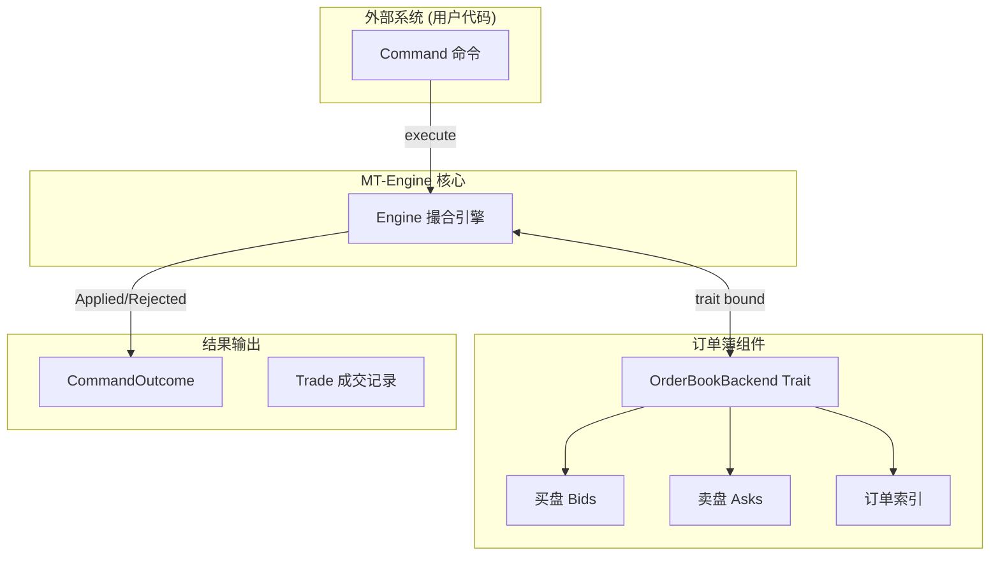
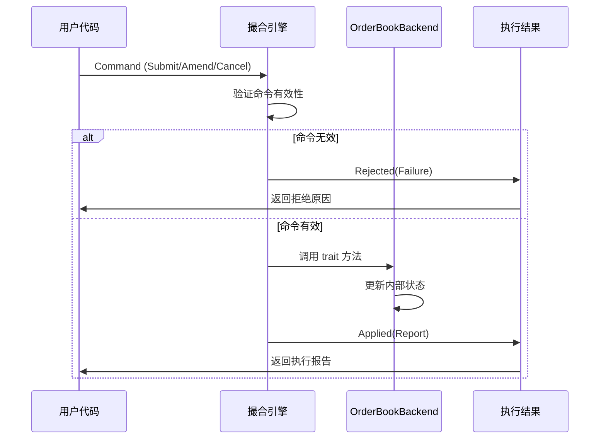
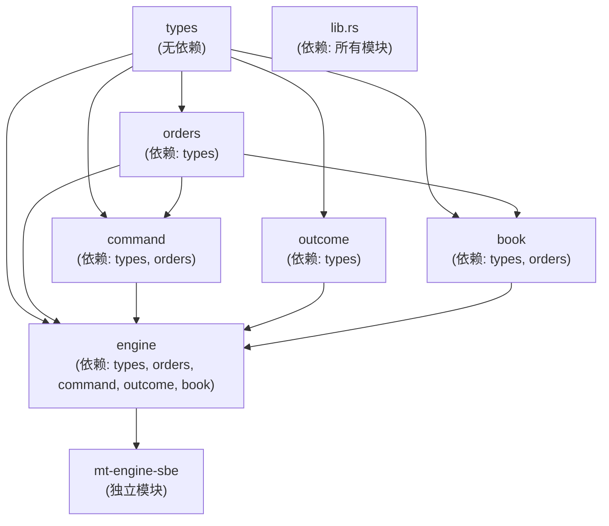

# MT-Engine 撮合引擎架构设计文档

[English](ARCHITECTURE.md) | [中文](ARCHITECTURE_ZH.md)

## 1. 概述

### 1.1 项目背景与目标

MT-Engine 是一个高性能、确定性的订单撮合引擎库，采用 Rust 语言实现。它专为交易系统设计，遵循 LMAX 架构的核心原则，将撮合引擎实现为单线程、确定性、内存状态机。

**核心设计目标：**

- **确定性执行**：相同输入必须产生相同输出，支持回测、重放和审计
- **单线程设计**：避免锁竞争和同步开销，实现可预测的低延迟
- **纯内存状态**：所有状态存储在内存中，不处理持久化和网络通信
- **命令-结果模型**：清晰的输入输出契约，便于集成和测试

### 1.2 核心术语定义

| 术语 | 定义 |
|------|------|
| **订单簿 (Order Book)** | 记录所有未成交订单的数据结构 |
| **撮合 (Matching)** | 根据价格-时间优先原则将买卖订单配对成交的过程 |
| **Taker** | 主动发起交易的一方，消耗市场流动性 |
| **Maker** | 被动等待成交的一方，提供市场流动性 |
| **价格级别 (Price Level)** | 同一价格下的所有订单组成的价格级别 |
| **时间优先级 (Time Priority)** | 同价格级别内，先提交的订单优先成交 |
| **SBE (Simple Binary Encoding)** | 高性能二进制编码标准，用于消息序列化 |
| **确定性 (Deterministic)** | 给定相同初始状态和命令序列，必然产生相同结果 |

### 1.3 项目阶段

| 阶段 | 状态 | 说明 |
|------|------|------|
| **Phase 1: SBE 协议层** | ✅ 已完成 | 二进制消息编解码，支持 OrderSubmit/Cancel/Amend/Trade |
| **Phase 2: 核心撮合引擎实现** | ✅ 已完成 | 实现了基于 LTP 触发的止损/止盈闭环、冰山重排、宏观测试、泛型后端及 E2E 策略 |
| **Phase 3: 性能优化 (Sparse)** | ✅ 已完成 | 全链路零分配、SBE unwrap_unchecked、硬件预取介入、缓存行 ABI 极致对齐 |
| **Phase 4: Dense Engine 与可扩展** | 🚧 规划中 | 基于 Bitset 的无树后端、分布式定序器 (Sequencer) 及集群持久化整合方案 |

### 1.4 设计原则

1. **不可变性优于可变**：优先使用不可变数据结构，减少副作用
2. **明确优于隐式**：API 设计强调清晰性而非简洁性
3. **组合优于继承**：使用组合模式构建复杂类型
4. **错误即值**：使用 Result 类型处理错误，而非异常机制
5. **零成本抽象**：抽象层不应带来运行时开销
6. **SBE 兼容**：对外暴露的 struct 都设计为固定大小，便于 SBE 解析器处理

---

## 2. 项目结构

### 2.1 代码组织

```
mt-engine/
├── Cargo.toml              # Workspace 配置
├── mt-engine-core/         # 🚧 规划中 - 核心引擎
│   └── Cargo.toml
├── mt-engine-sbe/          # ✅ 已完成 - SBE 编解码层
│   ├── src/
│   │   ├── lib.rs                          # 库入口，导出所有编解码器
│   │   ├── message_header_codec.rs         # 消息头编解码
│   │   ├── order_submit_codec.rs           # 订单提交 (64 bytes)
│   │   ├── order_cancel_codec.rs           # 订单取消 (24 bytes)
│   │   ├── order_amend_codec.rs            # 订单修改 (40 bytes)
│   │   ├── order_submit_gtd_codec.rs       # GTD订单提交 (72 bytes)
│   │   ├── trade_codec.rs                 # 成交记录 (64 bytes)
│   │   ├── side.rs                        # 买卖方向枚举
│   │   ├── order_type.rs                  # 订单类型枚举
│   │   ├── time_in_force.rs               # 时间效力枚举
│   │   └── order_flags.rs                 # 订单标志位集合
│   └── Cargo.toml
├── schemas/                 # SBE XML Schema 定义
│   └── mt-engine/
│       └── templates_FixBinary.xml
└── docs/                    # 文档
    ├── ARCHITECTURE.md
    ├── SBE_INTEGRATION_GUIDE.md
    └── SBE_OFFICIAL_MIGRATION_GUIDE.md
```

---

## 3. Phase 1: SBE 协议层 ✅ 已完成

### 3.1 消息类型总览

| 消息 | ID | 大小 | 说明 |
|------|-----|------|------|
| `OrderSubmit` | 1 | 64 bytes | 订单提交命令 |
| `OrderCancel` | 2 | 24 bytes | 订单取消命令 |
| `OrderAmend` | 3 | 40 bytes | 订单修改命令 |
| `OrderSubmitGtd` | 4 | 72 bytes | GTD 订单提交（含过期时间） |
| `Trade` | 101 | 64 bytes | 成交记录 |

### 3.2 枚举类型

#### Side (买卖方向)

```rust
pub enum Side {
    buy = 0,
    sell = 1,
}
```

#### OrderType (订单类型)

```rust
pub enum OrderType {
    market = 0,     // 市价单
    limit = 1,      // 限价单
    stop = 2,       // 止损单
    stop_limit = 3, // 止损限价单
}
```

#### TimeInForce (时间效力)

```rust
pub enum TimeInForce {
    ioc = 0,  // Immediate Or Cancel - 即时成交否则取消
    fok = 1,  // Fill Or Kill - 全部成交否则取消
    gtc = 2,  // Good Till Cancel - 永久有效
    gtd = 3,  // Good Till Date - 指定时间前有效
    gth = 4,  // Good Till Hour - 当小时有效
}
```

#### OrderStatus (订单状态)

```rust
pub enum OrderStatus {
    pending = 0,          // 待处理
    order_new = 1,        // 新订单
    partially_filled = 2, // 部分成交
    filled = 3,           // 完全成交
    cancelled = 4,        // 已取消
    rejected = 5,         // 已拒绝
    expired = 6,          // 已过期
    traded = 7,           // 已交易
}
```

### 3.3 消息结构

#### OrderSubmit (订单提交) - 64 bytes

| 字段 | 类型 | 偏移 | 大小 | 说明 |
|------|------|------|------|------|
| order_id | OrderId | 0 | 8 | 订单唯一标识 |
| user_id | UserId | 8 | 8 | 用户标识 |
| side | Side | 16 | 1 | 买卖方向 |
| order_type | OrderType | 17 | 1 | 订单类型 |
| price | Price | 18 | 8 | 价格 |
| quantity | Quantity | 26 | 8 | 数量 |
| time_in_force | TimeInForce | 34 | 1 | 时间效力 |
| flags | OrderFlags | 35 | 2 | 订单标志 |
| timestamp | Timestamp | 37 | 8 | 时间戳 |
| sequence_number | SequenceNumber | 45 | 8 | 序列号 |
| (reserved) | | 53 | 11 | 填充对齐 |

#### OrderCancel (订单取消) - 24 bytes

| 字段 | 类型 | 偏移 | 大小 | 说明 |
|------|------|------|------|------|
| order_id | OrderId | 0 | 8 | 要取消的订单ID |
| timestamp | Timestamp | 8 | 8 | 时间戳 |
| sequence_number | SequenceNumber | 16 | 8 | 序列号 |

#### OrderAmend (订单修改) - 40 bytes

| 字段 | 类型 | 偏移 | 大小 | 说明 |
|------|------|------|------|------|
| order_id | OrderId | 0 | 8 | 要修改的订单ID |
| new_price | Price | 8 | 8 | 新价格 |
| new_quantity | Quantity | 16 | 8 | 新数量 |
| timestamp | Timestamp | 24 | 8 | 时间戳 |
| sequence_number | SequenceNumber | 32 | 8 | 序列号 |

#### OrderSubmitGtd (GTD 订单) - 72 bytes

| 字段 | 类型 | 偏移 | 大小 | 说明 |
|------|------|------|------|------|
| order_id | OrderId | 0 | 8 | 订单唯一标识 |
| user_id | UserId | 8 | 8 | 用户标识 |
| side | Side | 16 | 1 | 买卖方向 |
| order_type | OrderType | 17 | 1 | 订单类型 |
| price | Price | 18 | 8 | 价格 |
| quantity | Quantity | 26 | 8 | 数量 |
| time_in_force | TimeInForce | 34 | 1 | 时间效力 |
| flags | OrderFlags | 35 | 2 | 订单标志 |
| expiry_time | ExpiryTime | 37 | 8 | 过期时间 |
| timestamp | Timestamp | 45 | 8 | 时间戳 |
| sequence_number | SequenceNumber | 53 | 8 | 序列号 |
| (reserved) | | 61 | 11 | 填充对齐 |

#### Trade (成交记录) - 64 bytes

| 字段 | 类型 | 偏移 | 大小 | 说明 |
|------|------|------|------|------|
| trade_id | OrderId | 0 | 8 | 成交ID |
| maker_order_id | OrderId | 8 | 8 | Maker订单ID |
| taker_order_id | OrderId | 16 | 8 | Taker订单ID |
| side | Side | 24 | 1 | 成交方向 |
| price | Price | 25 | 8 | 成交价格 |
| quantity | Quantity | 33 | 8 | 成交数量 |
| timestamp | Timestamp | 41 | 8 | 时间戳 |
| sequence_number | SequenceNumber | 49 | 8 | 序列号 |
| (reserved) | | 57 | 7 | 填充对齐 |

### 3.4 OrderFlags (订单标志位)

| 标志 | 位 | 说明 |
|------|-----|------|
| post_only | 0 | 仅Maker订单，不消耗流动性 |
| reduce_only | 1 | 只减仓，不能加仓 |
| iceberg | 2 | 冰山订单 |
| hidden | 3 | 隐藏订单 |
| marketable | 4 | 可市价成交 |
| disable_self_trade | 5 | 禁止自成交 |

---

## 4. Phase 2: 撮合引擎核心 ✅ 已完成

### 4.1 整体架构



### 4.2 命令-结果执行模型



### 4.3 订单簿后端抽象

#### OrderBookBackend Trait

```rust
// book/backend/mod.rs

use crate::{Order, RestingOrder, Price, Side};

/// 订单簿后端存储 trait - 零成本抽象核心
/// 撮合逻辑通过此 trait 与底层存储解耦
pub trait OrderBookBackend: Sized {
    /// 订单索引类型
    type OrderIdx: Copy + PartialEq + std::fmt::Debug;
    /// 级别索引类型
    type LevelIdx: Copy + PartialEq + std::fmt::Debug;

    // === 级别操作 ===

    fn best_bid_price(&self) -> Option<Price>;
    fn best_ask_price(&self) -> Option<Price>;
    fn get_level(&self, price: Price) -> Option<Self::LevelIdx>;
    fn get_or_create_level(&mut self, price: Price) -> Self::LevelIdx;
    fn remove_empty_level(&mut self, level_idx: Self::LevelIdx);

    // === 订单操作 ===

    fn insert_order(&mut self, order: RestingOrder) -> Self::OrderIdx;
    fn get_order_mut(&mut self, idx: Self::OrderIdx) -> Option<&mut RestingOrder>;
    fn remove_order(&mut self, idx: Self::OrderIdx) -> Option<RestingOrder>;

    // === 队列操作 ===

    fn push_to_level(&mut self, level_idx: Self::LevelIdx, order_idx: Self::OrderIdx);
    fn pop_from_level(&mut self, level_idx: Self::LevelIdx) -> Option<Self::OrderIdx>;
    fn remove_from_level(&mut self, level_idx: Self::LevelIdx, order_idx: Self::OrderIdx) -> bool;
    fn level_order_count(&self, level_idx: Self::LevelIdx) -> usize;
}
```

### 4.4 双模式存储策略

支持两种实现，用户可根据交易品种特征选择：

| 特性 | `dense` (高频) | `sparse` (通用) |
|------|---------------|-----------------|
| **价格定位** | Vec + L3 Bitset | BTreeMap |
| **订单映射** | 数组 + 空闲链表 | Slab + HashMap |
| **队列结构** | 侵入式双向链表 | VecDeque |
| **内存分配** | 预分配 | 动态分配 |
| **延迟预期** | < 100ns | 500ns - 2μs |
| **适用场景** | BTC/ETH 主流币 | 山寨币/NFT/长尾资产 |

**设计理念**：`dense` 用空间换时间，`sparse` 按需分配。

### 4.5 Dense 实现（高频模式）

Dense 后端采用以下优化策略：

#### 侵入式双向链表设计

```rust
// book/backend/dense.rs

/// 链表指针（固定大小 16 bytes）
///
/// 侵入式链表设计：订单内置前后指针，无需额外节点结构
/// 撤单时直接修改指针，O(1) 时间复杂度
///
/// **字段说明：**
/// - `prev`: 前一个订单索引（0 表示链表头）
/// - `next`: 下一个订单索引（0 表示链表尾）
/// - `level_idx`: 所属价格级别索引，用于快速定位父级别
#[repr(C)]
#[derive(Clone, Copy, Default)]
pub struct OrderLink {
    pub prev: u32,      // 前一个订单索引
    pub next: u32,      // 下一个订单索引
    pub level_idx: u32, // 所属级别索引
    pub _padding: u32,  // 对齐填充
}

/// Dense 后端核心结构
pub struct DenseBackend {
    config: PriceRange,
    /// 价格 ID 到档位数据的物理寻址
    level_array: Vec<Option<LevelData>>,
    bitset: L3Bitset,

    /// OrderID 到物理订单索引的直接映射 (15ns 级响应)
    id_to_index: Vec<u32>,

    /// 订单池：固定大小的 OrderData 数组
    order_pool: Vec<OrderData>,
    /// 订单链表指针：侵入式链表
    order_links: Vec<OrderLink>,
    /// 空闲链表：回收删除的订单槽位
    free_list: Vec<u32>,
}
```

#### L3 Bitset 实现（O(1) 最佳价格搜索）

```rust
// book/backend/bitset.rs

/// 三级位图：O(1) 找到第一个/最后一个 set bit
pub struct L3Bitset {
    l1: Vec<u64>,  // 顶层掩码
    l2: Vec<u64>,  // 中层掩码
    l3: Vec<u64>,  // 底层位图
}

impl L3Bitset {
    pub fn new(depth: usize) -> Self {
        let l3_words = (depth + 63) / 64;
        let l2_words = (l3_words + 63) / 64;
        let l1_words = (l2_words + 63) / 64;
        Self {
            l1: vec![0; l1_words],
            l2: vec![0; l2_words],
            l3: vec![0; l3_words],
        }
    }

    pub fn set(&mut self, idx: usize) {
        let l3_idx = idx / 64;
        let l3_bit = 1u64 << (idx % 64);
        self.l3[l3_idx] |= l3_bit;
        self.l2[l3_idx / 64] |= 1u64 << (l3_idx % 64);
        self.l1[l3_idx / 4096] |= 1u64 << ((l3_idx / 64) % 64);
    }

    /// 找到第一个 set bit（最佳卖价）
    pub fn find_first(&self, max: usize) -> Option<usize> {
        for (l1_idx, &l1_word) in self.l1.iter().enumerate() {
            if l1_word == 0 { continue; }
            let l2_word_idx = (l1_word.trailing_zeros()) as usize + l1_idx * 64;
            let l2_word = self.l2.get(l2_word_idx)?;
            if l2_word == 0 { continue; }
            let l3_word_idx = (l2_word.trailing_zeros()) as usize + l2_word_idx * 64;
            let l3_word = self.l3.get(l3_word_idx)?;
            let bit = l3_word.trailing_zeros() as usize;
            let global_idx = l3_word_idx * 64 + bit;
            if global_idx < max { return Some(global_idx); }
        }
        None
    }

    /// 找到最后一个 set bit（最佳买价）
    pub fn find_last(&self, max: usize) -> Option<usize> {
        for l1_idx in (0..self.l1.len()).rev() {
            let l1_word = self.l1[l1_idx];
            if l1_word == 0 { continue; }
            let l2_idx = (63 - l1_word.leading_zeros()) as usize + l1_idx * 64;
            let l2_word = self.l2.get(l2_idx)?;
            if l2_word == 0 { continue; }
            let l3_idx = (63 - l2_word.leading_zeros()) as usize + l2_idx * 64;
            let l3_word = self.l3.get(l3_idx)?;
            let bit = 63 - l3_word.leading_zeros();
            let global_idx = l3_idx * 64 + bit as usize;
            if global_idx < max { return Some(global_idx); }
        }
        None
    }
}
```

### 4.6 Sparse 实现（通用模式）

```rust
// book/backend/sparse.rs

use rustc_hash::FxHashMap;
use std::collections::BTreeMap;

/// 稀疏存储后端 - 适合长尾资产
/// Value 使用固定大小的 OrderData，便于网络传输和持久化
pub struct SparseBackend {
    /// 买盘：价格 -> LevelIdx（按价格降序）
    bids: BTreeMap<Price, LevelIdx>,
    /// 卖盘：价格 -> LevelIdx（按价格升序）
    asks: BTreeMap<Price, LevelIdx>,

    /// 价格级别存储：Slab 实现 O(1) 索引
    levels: Slab<PriceLevel>,
    /// 订单索引：OrderId -> OrderIdx
    order_map: FxHashMap<OrderId, OrderIdx>,
    /// 订单数据：Slab + OrderData（固定大小，可直接序列化）
    orders: Slab<OrderData>,
}
```

### 4.7 SoA vs AoS 优化

```
AoS 模式（传统）：
┌─────────────────────────────────┐
│ Order[0]: { qty, side, ts, uid }│  ← 访问 qty 时，ts/uid 也加载到缓存
│ Order[1]: { qty, side, ts, uid }│
│ Order[2]: { qty, side, ts, uid }│
└─────────────────────────────────┘

SoA 模式（优化后）：
┌─────────────────────────────────┐
│ qty_array:  [10, 20, 30, ...]   │  ← 只加载需要的字段
│ side_array: [0,  1,  0,  ...]   │  ← 缓存行只包含热数据
├─────────────────────────────────┤
│ ts_array:   [ts1, ts2, ts3,...] │  ← 冷数据按需加载
│ uid_array:  [u1,  u2,  u3,...]  │
└─────────────────────────────────┘

缓存命中率对比（撮合场景）：
- AoS: ~60%（加载了不需要的字段）
- SoA: ~95%（只加载热数据）
```

---

## 5. Phase 3: 性能优化 📋 规划中

### 5.1 预取优化

#### DenseOperations Trait

```rust
/// Dense 后端特有操作（用于预取优化）
pub trait DenseOperations {
    fn prefetch_orders(&self, order_idx: u32);
    fn get_hot(&self, idx: u32) -> Option<&OrderHotData>;
    fn get_hot_mut(&mut self, idx: u32) -> Option<&mut OrderHotData>;
    fn get_next(&self, idx: u32) -> u32;
}

impl DenseOperations for DenseBackend {
    /// 预取订单热数据到 L1 缓存
    #[inline(always)]
    fn prefetch_orders(&self, order_idx: u32) {
        if order_idx == 0 { return; }

        let link = self.order_links[order_idx as usize];
        let next1 = link.next;
        let next2 = if next1 != 0 { self.order_links[next1 as usize].next } else { 0 };

        #[cfg(target_arch = "x86_64")]
        unsafe {
            if next1 != 0 {
                std::arch::x86_64::_mm_prefetch::<_MM_HINT_T0>(self.order_pool_raw(next1) as *const i8);
            }
            if next2 != 0 {
                std::arch::x86_64::_mm_prefetch::<_MM_HINT_T0>(self.order_pool_raw(next2) as *const i8);
            }
        }
    }
}
```

#### 预取时序图

```
时间轴:
CPU 执行:  [处理 N  ]→[处理 N+1]→[处理 N+2]→...
           ↓
内存加载:   [加载 N ]→[加载 N+1]→[加载 N+2]→...
           ↓
           [预取 N+1]→[预取 N+2]→[预取 N+3]→...

理想情况：CPU 等待内存的时间被完全隐藏
实际收益：延迟降低 15-30%（取决于内存带宽）
```

### 5.2 iCache 优化：#[cold] + #[inline(never)]

将错误处理逻辑和复杂业务逻辑标记为冷路径，确保热路径（撮合主循环）完整装入 L1 iCache。

```rust
// 热路径 - 最小化，只包含关键逻辑
#[inline(always)]
pub fn execute(&mut self, command: Command) -> CommandOutcome {
    match self.validate_meta_fast(&command.meta) {
        Ok(()) => {},
        Err(e) => return CommandOutcome::Rejected(e),
    }
    match command.kind {
        CommandKind::Submit(cmd) => self.handle_submit(command.meta, cmd),
        CommandKind::Amend(cmd) => self.handle_amend(command.meta, cmd),  // cold path
        CommandKind::Cancel(cmd) => self.handle_cancel(command.meta, cmd),  // cold path
    }
}

// 冷路径 - 错误处理和复杂逻辑
#[cold]
#[inline(never)]
fn handle_cancel(&mut self, meta: CommandMeta, cmd: CancelCmd) -> CommandOutcome {
    // 完整的取消逻辑
}

#[cold]
#[inline(never)]
fn make_sequence_error(&self, current: SequenceNumber, last: SequenceNumber) -> CommandFailure {
    // 错误创建
}
```

### 5.3 内存布局示意

```
DenseBackend 内存布局（每 MB 可容纳约 16K 订单）

Cache Line (64 bytes):
┌────────────────────────────────────┬────────────────────────────────────┐
│ order_hot[0..7]  (8 × 8 bytes)    │ order_hot[8..15]                   │
│   qty(8) + filled(8) + ...        │                                    │
├────────────────────────────────────┼────────────────────────────────────┤
│ order_links[0..11] (12 × 4 bytes)│ (padding)                          │
│   prev(4) + next(4) + level(4)    │                                    │
└────────────────────────────────────┴────────────────────────────────────┘

空闲链表：O(1) 分配/回收
LevelData：只存 head/tail 索引，无数据副本
```

---

## 6. 核心数据结构设计

### 6.1 订单数据

```rust
/// 订单数据（极致对齐版：128 bytes，完美对齐缓存行）
///
/// **布局设计原则：**
/// - 热数据 (Hot Data)：撮合时高频访问的字段落在第一个 64 字节缓存行。
/// - 冷数据 (Cold Data)：用户信息、订单 ID 等落在第二个缓存行。
#[repr(C, align(128))]
#[derive(Clone, Copy)]
pub struct OrderData {
    // ========== [HOT DATA: Line 0 (64 bytes)] ==========
    pub remaining_qty: Quantity, // 剩余数量
    pub filled_qty: Quantity,    // 已成交数量
    pub price: Price,           // 价格
    pub side: Side,             // 买卖方向
    pub order_type: OrderType,  // 订单类型 (Market/Limit/Stop)
    pub flags: OrderFlags,      // 功能预留位 (Post-Only/Iceberg)
    pub visible_qty: Quantity,  // 冰山单可见数量
    pub peak_size: Quantity,    // 冰山单峰值
    pub expiry: Timestamp,      // 过期时间 (Zero = GTC)
    pub trigger_price: Price,   // 止损单触发价

    // ========== [COLD DATA: Line 1 (64 bytes)] ==========
    pub order_id: OrderId,      // 订单 ID
    pub user_id: UserId,        // 用户 ID
    pub sequence_number: SequenceNumber,
    pub timestamp: Timestamp,
    // (Reserved for future use)
}
```

### 6.2 基础类型

```rust
// types/mod.rs - 基础类型定义

/// 价格类型，精度由外部决定（如 8 位小数精度）
#[derive(Debug, Clone, Copy, PartialEq, Eq, PartialOrd, Ord, Hash)]
pub struct Price(pub u64);

/// 数量类型，表示订单的委托数量
#[derive(Debug, Clone, Copy, PartialEq, Eq, PartialOrd, Ord, Hash)]
pub struct Quantity(pub u64);

/// 订单唯一标识符
#[derive(Debug, Clone, Copy, PartialEq, Eq, PartialOrd, Ord, Hash)]
pub struct OrderId(pub u64);

/// 序列号，用于确保命令顺序和实现时间优先级
#[derive(Debug, Clone, Copy, PartialEq, Eq, PartialOrd, Ord, Hash)]
pub struct SequenceNumber(pub u64);

/// 时间戳，毫秒精度
#[derive(Debug, Clone, Copy, PartialEq, Eq, PartialOrd, Ord, Hash)]
pub struct Timestamp(pub u64);
```

### 6.3 命令结构

```rust
// command/mod.rs - 命令模块

/// 命令元数据 - 所有命令的公共信息
#[derive(Debug, Clone, Copy)]
pub struct CommandMeta {
    pub sequence_number: SequenceNumber,
    pub timestamp: Timestamp,
}

/// 命令类型
#[derive(Debug, Clone, PartialEq, Eq)]
pub enum CommandKind {
    Submit(SubmitCmd),
    Amend(AmendCmd),
    Cancel(CancelCmd),
}

/// 命令 - 订单簿的唯一输入
#[derive(Debug, Clone, PartialEq, Eq)]
pub struct Command {
    pub meta: CommandMeta,
    pub kind: CommandKind,
}
```

### 6.4 结果结构

```rust
// outcome/mod.rs - 结果模块

/// 命令执行结果 - 订单簿的唯一输出
#[derive(Debug, Clone, PartialEq, Eq)]
pub enum CommandOutcome {
    Applied(CommandReport),
    Rejected(CommandFailure),
}

/// 成交记录
#[derive(Debug, Clone, PartialEq, Eq)]
pub struct Trade {
    pub buy_order_id: OrderId,
    pub sell_order_id: OrderId,
    pub price: Price,
    pub quantity: Quantity,
    pub timestamp: Timestamp,
}

/// 订单状态
#[derive(Debug, Clone, Copy, PartialEq, Eq)]
pub enum OrderStatus {
    Pending,
    Filled,
    PartiallyFilled,
    Cancelled,
    Rejected,
}
```

---

## 7. 撮合引擎实现

### 7.1 Engine 结构

```rust
// engine/mod.rs

/// 撮合引擎 - 单线程、确定性的状态机
/// 设计原则：热路径（撮合主循环）尽可能小，完整装入 L1 iCache
pub struct Engine<B: OrderBookBackend = SparseBackend> {
    backend: B,
    last_sequence_number: Option<SequenceNumber>,
    last_timestamp: Option<Timestamp>,
    next_order_id: OrderId,
}

impl<B: OrderBookBackend> Engine<B> {
    /// 主入口 - 热路径
    #[inline(always)]
    pub fn execute(&mut self, command: Command) -> CommandOutcome {
        // 验证在 hot path 中保持最小化
        match self.validate_meta_fast(&command.meta) {
            Ok(()) => {},
            Err(e) => return CommandOutcome::Rejected(e),
        }

        // 快速分发
        match command.kind {
            CommandKind::Submit(cmd) => self.handle_submit(command.meta, cmd),
            CommandKind::Amend(cmd) => self.handle_amend(command.meta, cmd),
            CommandKind::Cancel(cmd) => self.handle_cancel(command.meta, cmd),
        }
    }
}
```

### 7.2 撮合算法

撮合引擎采用**价格-时间优先**算法：

1. **价格优先**：买订单按价格降序成交，卖订单按价格升序成交
2. **时间优先**：同价格内，先提交的订单优先成交
3. **预取优化**：处理订单 N 时并行加载 N+1, N+2

---

## 8. 模块依赖关系



---

## 9. 时间复杂度

| 操作 | Sparse | Dense |
|------|--------|-------|
| 最佳买/卖价 | O(log N) | **O(1)** |
| 插入订单 | O(log N) | O(1) |
| 撤单 | O(N) | **O(1)** |
| 撮合查找 | O(M log N) | O(M) |

---

## 10. 附录

### 10.1 参考资料

- [LMAX Architecture](https://martinfowler.com/articles/lmax.html)
- [Rust Performance Book](https://nnethercote.github.io/perf-book/)
- [SBE Official Site](https://www.fixtrading.org/standards/sbe/)

### 10.2 术语表

| 英文 | 中文 | 说明 |
|------|------|------|
| Order Book | 订单簿 | 记录所有未成交订单 |
| Matching Engine | 撮合引擎 | 执行订单配对成交 |
| Limit Order | 限价订单 | 指定价格的订单 |
| Market Order | 市价订单 | 以最优价格成交 |
| Post-Only | 仅-maker | 不消耗流动性的订单 |
| Maker | 做市商 | 提供流动性 |
| Taker | 吃单方 | 消耗流动性 |

### 10.3 后续扩展方向

1. **Pegged Orders**：追踪最佳买卖价的动态订单
2. **Conditional Orders**：条件单（市价触发）
3. **Snapshot/Restore**：状态快照与恢复
4. **Multi-Asset Support**：多交易对支持
